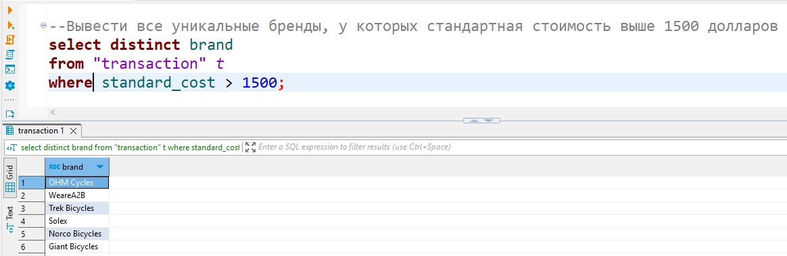
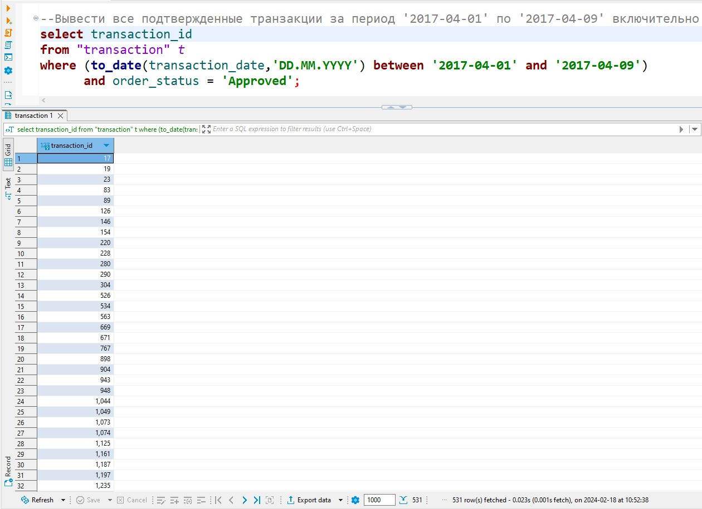
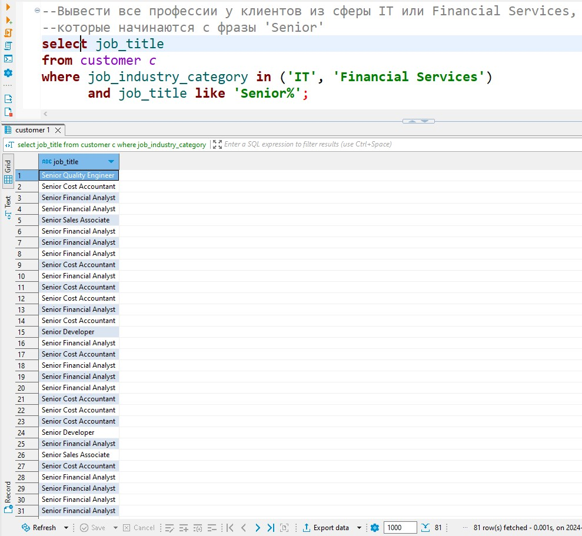
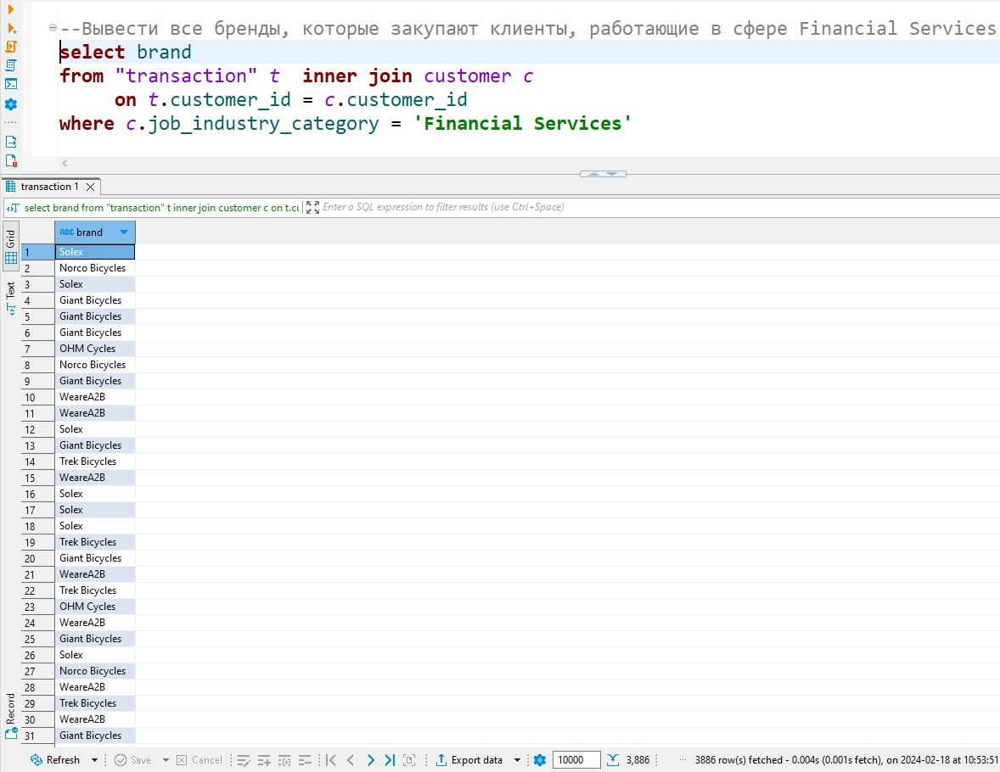
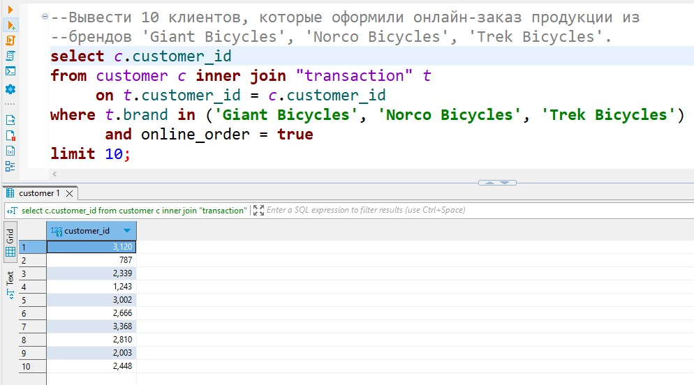
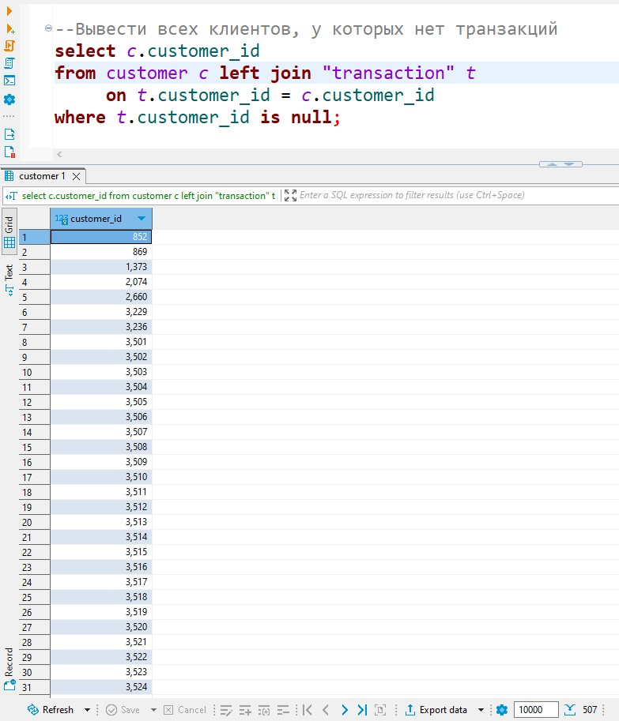
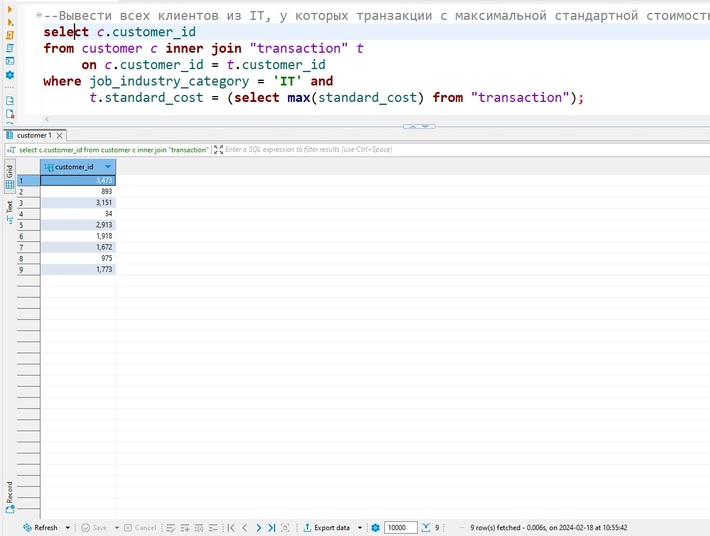
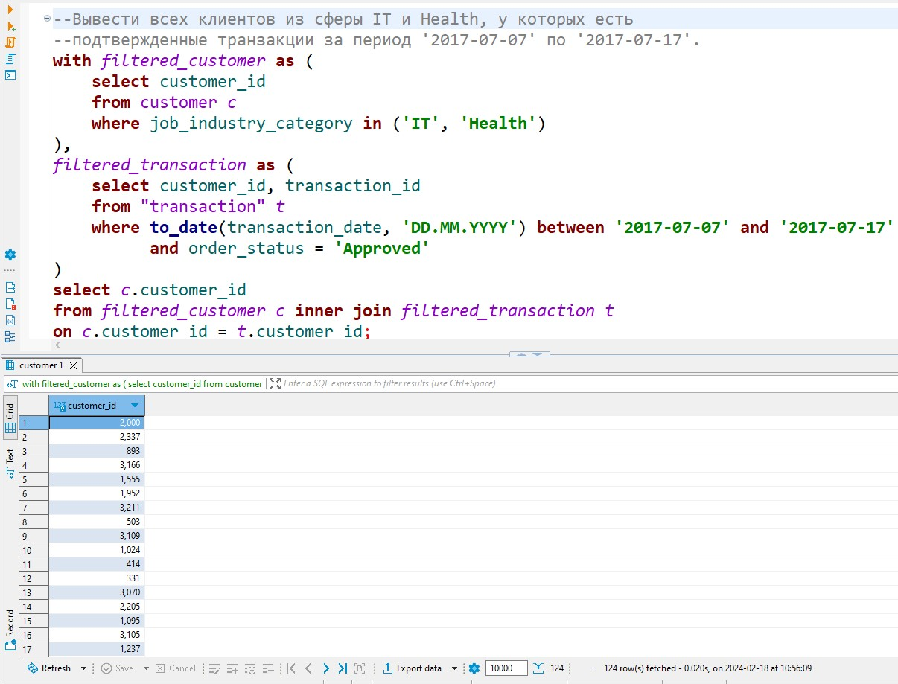

# SQL операторы

## Задание 1

**Вывести все уникальные бренды, у которых стандартная стоимость выше 1500 долларов.**

## Задание 2

**Вывести все подтвержденные транзакции за период '2017-04-01' по '2017-04-09' включительно.**

## Задание 3

**Вывести все профессии у клиентов из сферы IT или Financial Services, которые начинаются с фразы 'Senior'.**

## Задание 4

**Вывести все бренды, которые закупают клиенты, работающие в сфере Financial Services.**

## Задание 5

**Вывести 10 клиентов, которые оформили онлайн-заказ продукции из брендов 'Giant Bicycles', 'Norco Bicycles', 'Trek Bicycles'.**

## Задание 6

**Вывести всех клиентов, у которых нет транзакций.**

## Задание 7

**Вывести всех клиентов из IT, у которых транзакции с максимальной стандартной стоимостью.**

## Задание 8

**Вывести всех клиентов из сферы IT и Health, у которых есть подтвержденные транзакции за период '2017-07-07' по '2017-07-17'.**

